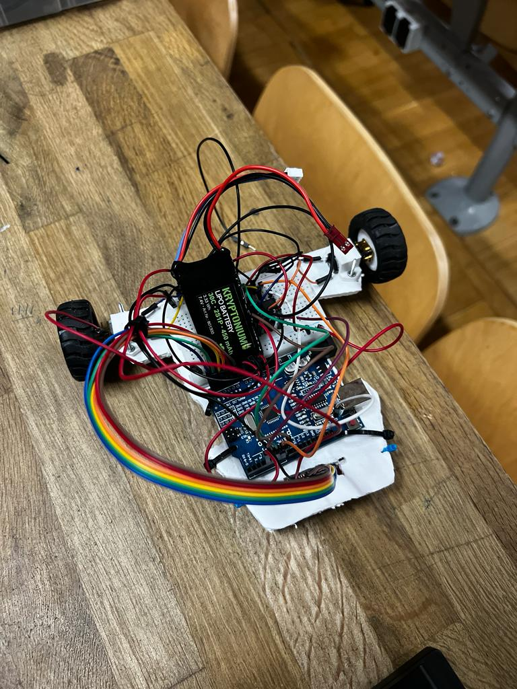

# IntroductionToRobotics-LineFollower 

### This was the last project of Introduction to Robotics course: Line Follower. 

## Description 
 - A line follower project is a robot that is designed to follow a specific path or line 🚗. The robot uses sensors to detect the location of the line and then adjusts its movement accordingly. 
 - We used PID controller 🕹️ - a control loop feedback mechanism that keeps the robot on the line. It uses Proportional, Integral and Derivative to minimize the error. 

## Components 📌 - from a line follower kit
 - Arduino Uno
 - 2 DC motors
 - 2 wheels
 - LiPo Battery
 - QTR-8A reflectance sensor (8 IR array) -> out of which we used 6
 - L293D motor driver
 - wires, breadboard, chassis

 ## Features & Parameters ⚙️
 - We made an automatic calibration for 6 seconds by powering the right motor until the sensor is out of the line and after we power the left motor and so on.
 - Then we move the car left or right until the sensor is centered on the line.
 - We map the error from sensors to [-30, 30] interval and apply PID with kp = 13.2, ki = 0, kd = 2. 
 - For a better approach in tight turns, we spin one motor forward and the other backwards.

## Context 🚀
 - We got the line follower kit.
 - 
 - Need to code the PID Controller (in our case just PD) to make the robot complete a "mistery" track in less than 20 seconds.
 - The coding part was done during a 1 day hackathon.

## Results 🏎️
 - The best time of our robot was 23.825s (from 3 tries).
 - The robot keeps shaking on the line, maybe the **kp** was a little too high.

### I teamed up with <a href = "https://github.com/IaniIspas">Ispas Jany-Gabriel</a> (Team Otelu Chindia).
 

 

 

  <h3>
    <a href="https://youtu.be/1SETAbmxz9I">
      ▶️ Click here for video
    </a>
  </h3>

